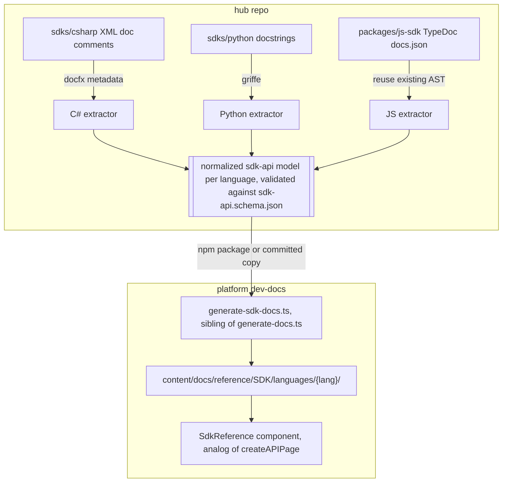

# SDK docs generation

This is a plan for generating reference documentation for the backend language SDKs (`sdks/csharp`, `sdks/python`, and whatever we add next) and publishing it into the Fumadocs dev-docs site, the same way we already generate the REST reference from `openapi.json`. It is a design doc, not shipped code. Nothing here is built yet.

Scope: the API-client SDKs only. That means `sdks/*` and `packages/js-sdk`. The frontend UI SDKs (`react-sdk`, `angular-sdk`, `vue-sdk`, `wc-sdk`, `web-sdk`) are out of scope; their docs are component and Storybook driven and follow a different track. The REST route reference is already covered by the OpenAPI pipeline, so it is out of scope too.

## The one idea

The REST reference works because there is one machine-readable contract, `openapi.json`, and a generator that turns it into pages. We do the same thing for SDKs: define one normalized doc model, the `sdk-api` model, as the shared contract; have each language emit into it with a thin extractor; and run a single generator that turns any model into MDX. This is the same split we already use for conformance, where `packages/conformance/fixtures.json` is the one shared file and each language writes a small adapter against it. We share data, not code.

Every language reimplements only the small, language-specific step: reading its own doc format (XML doc comments, docstrings, TypeDoc JSON) and normalizing it. Everything downstream, the generator and the rendering, is written once and never learns anything about a specific language.

## How the REST pipeline works today

Worth stating plainly, because the SDK pipeline mirrors it stage for stage.

1. Source of truth is TSDoc plus custom `@api*` tags on the js-sdk functions.
2. `packages/js-sdk` runs `typedoc` to emit `docs.json` (a reflection AST), then `openapi/generate-openapi.ts` walks that AST and writes `packages/js-sdk/openapi.json` (OpenAPI 3.1, roughly 56 paths).
3. The spec is copied into the dev-docs app at `apps/dev-docs/app/openapi.json` (today a manual `cp` on publish).
4. At build time, dev-docs runs `app/scripts/generate-docs.ts`, which calls `fumadocs-openapi`'s `generateFiles({ per: 'operation', groupBy: 'tag' })` and writes MDX into `content/docs/reference/Rest-API/api-docs/` (gitignored, regenerated every build).
5. Those MDX pages render through `createAPIPage(...)` from `fumadocs-openapi/ui`, registered in `app/mdx-components.tsx`.

The catch: `fumadocs-openapi` is special-cased for OpenAPI specs. There is no built-in Fumadocs integration that reads an SDK's class and method surface and produces a reference. So for SDKs we own two of the pieces that Fumadocs hands us for free on the REST side: the generator (`generateFiles` equivalent) and the render component (`createAPIPage` equivalent). The contract and the extractors are ours regardless.




## The normalized doc model

One JSON schema, `sdk-api.schema.json`, describes the shape every language emits. It is a symbol tree, not an HTTP-route list, because that is what an SDK actually is: namespaces or modules, holding types, holding members.

The top level carries the language, package name, and version so the generator can label pages and detect staleness. Under that is a flat list of groups. A group maps to an OpenAPI-style tag: the JS SDK already uses `@group` (Templates, Envelopes, Organizations), C# would group by namespace or by the same logical area, Python by resource namespace. Grouping is what drives the sidebar sections and mirrors `groupBy: 'tag'` on the REST side.

Each group holds symbols. A symbol is one documentable thing: a class, interface, method, property, enum, or free function. The fields are the union of what these languages express, and any field an extractor cannot fill is simply omitted.

```json
{
  "$schema": "./sdk-api.schema.json",
  "language": "csharp",
  "package": "Verdocs.Sdk",
  "version": "1.0.0",
  "groups": [
    {
      "id": "templates",
      "name": "Templates",
      "summary": "Read and manage templates.",
      "symbols": [
        {
          "kind": "method",
          "id": "VerdocsEndpoint.GetTemplatesAsync",
          "name": "GetTemplatesAsync",
          "signature": "Task<IReadOnlyList<Template>> GetTemplatesAsync(TemplateListOptions options)",
          "summary": "Get all templates accessible by the caller, with optional filters.",
          "params": [
            {
              "name": "options",
              "type": "TemplateListOptions",
              "description": "Visibility, paging, and sort filters.",
              "optional": false,
              "default": null
            }
          ],
          "returns": {
            "type": "Task<IReadOnlyList<Template>>",
            "description": "The templates the caller can see."
          },
          "throws": [
            {
              "type": "VerdocsApiException",
              "description": "The API returned a non-success status."
            }
          ],
          "examples": [
            {
              "language": "csharp",
              "code": "var templates = await endpoint.GetTemplatesAsync(new TemplateListOptions { IsStarred = true });"
            }
          ],
          "deprecated": false,
          "since": "1.0.0"
        }
      ]
    }
  ]
}
```

Field notes:


| Field                              | Role                                                                                              |
| ---------------------------------- | ------------------------------------------------------------------------------------------------- |
| `language` / `package` / `version` | Label pages, build the handoff, drive the staleness check                                         |
| `groups[].id` / `name` / `summary` | Sidebar section slug, title, and intro copy                                                       |
| `symbols[].kind`                   | One of `class`, `interface`, `method`, `property`, `enum`, `function`. Controls the page template |
| `symbols[].id`                     | Stable, unique within the language. Used for the URL slug and cross-references                    |
| `signature`                        | Rendered verbatim in the language's own syntax. The extractor formats this, not the generator     |
| `summary`                          | Plain-language sentence, straight from the doc comment                                            |
| `params` / `returns` / `throws`    | Tables in the rendered page. `throws` is empty for languages without exceptions                   |
| `examples`                         | Code blocks. `language` sets the Shiki grammar so a Python example highlights as Python           |
| `deprecated` / `since`             | Render a badge and a version note                                                                 |


The schema is the contract. If a language wants to say something the schema does not model, we extend the schema once and every language and the generator see it. We do not fork a second shape per language, the same rule we hold for `fixtures.json`.

## Per-language extractors

An extractor is the only language-specific code in the pipeline. Its job is narrow: run the language's native doc tool, then normalize that output into the `sdk-api` model and validate it against the schema. Extractors live next to the SDK they read, the way each conformance lane lives next to its SDK.

| Language                 | Extraction Tech                              | Description                                                                                                                                                                                                                                                                                                                                                                              |
| ------------------------ | -------------------------------------------- | ---------------------------------------------------------------------------------------------------------------------------------------------------------------------------------------------------------------------------------------------------------------------------------------------------------------------------------------------------------------------------------------- |
| C#                       | `docfx metadata` (over the XML doc file)     | `Verdocs.Sdk.csproj` sets `GenerateDocumentationFile` true, and missing docs fail the build under `-warnaserror`, guaranteeing full coverage. `docfx metadata` reads the compiled assembly plus the XML doc file and emits YAML API metadata (namespaces, types, members, params, returns, exceptions, summaries). A small normalizer maps that YAML to the model. DocFX is free and open source, so it fits our CI tooling constraints. Extractor home: `sdks/csharp/docs/`. |
| Python                   | `griffe`                                     | Python uses Google-style docstrings on every public callable, with `py.typed` shipped. `griffe`, the library `mkdocstrings` is built on, loads the package and produces a JSON dump of the API surface with parsed docstring sections (Args, Returns, Raises, Example). A normalizer maps `griffe`'s JSON to the model, expanding the sync and async resource namespaces (`endpoint.templates`, `endpoint.auth`) into groups. Extractor home: `sdks/python/docs/` (or a `docs` extra in `pyproject.toml`). |
| JavaScript / TypeScript  | TypeDoc AST (via `docs.json`)                | The JS SDK already produces `docs.json` from TypeDoc, and `openapi/generate-openapi.ts` already walks that exact AST. The JS extractor reuses that AST and emits the `sdk-api` model instead of (or alongside) the OpenAPI spec. This is the natural reference implementation to build first, because the input already exists and the AST-walking code is already proven. Shipping it also lets us replace the current js-sdk reference page, an iframe embed of the TypeDoc HTML site, with a native Fumadocs reference that matches the rest of the docs. |
| Go (later)               | `go/doc` or `gomarkdoc`                       | The standard library `go/doc` package parses source and doc comments into a structured model, or `gomarkdoc` for a higher-level dump; normalize either to the schema. Not in the repo yet, so this is a sketch. |
| Java (later)             | javadoc doclet or `javaparser`               | A small javadoc doclet, or `javaparser`, produces the type and member tree with Javadoc text. Not in the repo yet, so this is a sketch. The point of the shared model is that adding a language is an extractor plus a schema check, nothing downstream changes. |

## Where the pieces live

Following the conformance precedent (one shared contract, adapters next to each SDK), introduce a small shared package and keep the language work with the languages.

- `packages/sdk-docs` (new, `@verdocs/sdk-docs`): owns `sdk-api.schema.json`, the shared TypeScript types generated from it, and a validator (`sdk-docs validate <model.json>`). It also holds the committed model artifacts, `models/csharp.json`, `models/python.json`, `models/js.json`, so the contract and its instances live together and CI can diff them.
- `sdks/<lang>/docs/` and `packages/js-sdk`: each extractor, run by that SDK's own toolchain, writing its `models/<lang>.json` into the shared package.

Handoff to platform dev-docs: today `openapi.json` is copied across with a manual `cp` on publish, which is easy to forget and hard to see in a diff. Prefer publishing `@verdocs/sdk-docs` to npm and having dev-docs depend on it, the same way dev-docs already depends on `@verdocs/js-sdk`. Then refreshing the SDK reference is a version bump in dev-docs, visible in a lockfile diff and tied to a released version. Copying the JSON in is the fallback if we do not want another published package yet.

## Generating the docs in dev-docs

Mirror the REST generator exactly.

Add `apps/dev-docs/app/scripts/generate-sdk-docs.ts`, a sibling of `generate-docs.ts`, and wire it into the existing `generate` script next to `generate:openapi`. For each language model it:

1. Reads `models/<lang>.json` (from the `@verdocs/sdk-docs` dependency or the committed copy) and validates it against the schema, failing the build loudly on drift.
2. Wipes and regenerates `content/docs/reference/SDK/languages/<lang>/reference/`, the same wipe-and-regenerate contract `generate-docs.ts` uses for `api-docs/`, so the folder is a pure build artifact and stays gitignored.
3. Emits MDX per group (one page listing that group's symbols) or per symbol, plus a generated `meta.json` per language folder to order the sidebar.

Rendering is the `createAPIPage` analog we own. Add a `SdkReference` (and a smaller `SdkSymbol`) React component, registered in `app/mdx-components.tsx` alongside `APIPage`. It renders a symbol's signature, params table, returns, exceptions, and examples, using the same Shiki setup the REST pages use so a C# signature and a Python example each highlight in their own grammar. The generated MDX carries frontmatter (title, description) and drops in the component fed by the symbol data. Keeping this a real component, rather than pre-rendered HTML, is what makes the SDK reference themeable, searchable, and consistent with the REST reference instead of an iframe island.

Per-symbol versus per-group MDX granularity is an implementation choice: per-group keeps the tree shallow and readable for small SDKs (where we are today), per-symbol scales better and gives every method its own URL. Start per-group and split later if a group gets large.

## Sidebar placement

The dev-docs already have `content/docs/reference/SDK/languages/js-sdk/` with hand-written intro pages (installation, authentication, endpoints, examples) and a `reference.mdx` that currently iframes TypeDoc. Add `csharp/` and `python/` beside it under the same `languages/` parent. Each language keeps a couple of hand-written intro pages (installation, authentication) that we own as prose, plus the generated `reference/` subtree underneath. A generated `meta.json` orders the reference section; the hand-written `meta.json` orders the intro pages before it. This matches how js-sdk already mixes authored pages with a reference, and it means the generator never touches hand-written content.

## CI and the handoff

Two checks keep the models honest, both modeled on gates we already run.

- Schema validation: every committed `models/<lang>.json` must validate against `sdk-api.schema.json`. Fast, offline, runs on every PR that touches the package.
- Staleness: regenerate each model from source in CI and diff against the committed copy, the same idea as `pnpm --filter @verdocs/collections check` flagging a stale `openapi.json`. If a doc comment changed but the model was not regenerated, the check fails and tells you which command to run. Path-filtered so a docs-only change does not rebuild every SDK.

On the dev-docs side the build already runs `generate` before `next build`; `generate-sdk-docs.ts` slots into that step next to `generate:openapi`, so a deploy always regenerates the SDK reference from whatever model version dev-docs currently depends on. Publishing `@verdocs/sdk-docs` (or copying the models) is the seam between the two repos, and it is the one manual-ish step, exactly as `openapi.json` is today.

## Phased rollout

Phase 1: define `sdk-api.schema.json` and the `@verdocs/sdk-docs` package. Build the JS extractor by reusing the existing TypeDoc AST, since the input is already there. Build `generate-sdk-docs.ts` and the `SdkReference` component in dev-docs. Ship the js-sdk reference natively and retire the iframe. This proves the whole pipeline end to end against the SDK we know best.

Phase 2: add the C# extractor (`docfx metadata`) and the Python extractor (`griffe`), each emitting a validated model. The generator and component do not change; they already handle any model. C# and Python reference sections appear beside js-sdk.

Phase 3: add the CI staleness check, publish `@verdocs/sdk-docs` to npm and switch dev-docs to depend on it, and add Go and Java extractors when those SDKs land.

## Open questions

- Per-symbol versus per-group MDX granularity (start per-group).
- npm package versus committed-copy handoff to platform (recommend the package; copy is the fallback).
- Whether the JS extractor fully replaces or runs alongside `generate-openapi.ts`, since both walk the same `docs.json`. They can share the AST-walking code either way.
- How much authored intro prose each language gets versus generated reference, and who owns keeping the intro examples current.

